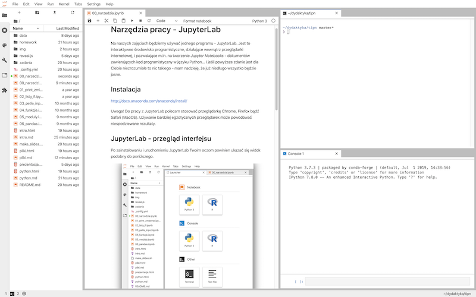

# Narzędzia

## JupyterLab

Na naszych zajęciach będziemy używać JupyterLab. Jest to interaktywne środowisko programistyczne, działające wewnątrz przeglądarki internetowej, i pozwalające m.in. na tworzenie _Jupyter Notebooks_ - dokumentów zawierających kod programistyczny w języku Python... I jeśli powyższe zdanie jest dla Ciebie niezrozumiałe to nic takiego - mam nadzieję, że już niedługo wszystko będzie jasne.

## Instalacja

> Uwaga! Do pracy z JupyterLab polecam stosować przeglądarkę Chrome, Firefox bądź Safari (MacOS). Używanie bardziej egzotycznych przeglądarek może powodować niespodziewane rezultaty.

### Lokalnie

Aby w prosty sposób uzyskać stabilne i dobrze "wyposażone" środowisko programistyczne, najlepiej jest zainstalować [Anaconda Distribution](https://www.anaconda.com/distribution/). Wybierz wersję Python 3.x żeby uzyskać dostęp do aktualnego Pythona. Proces instalacji dla różnych systemów operacyjnych opisany jest szczegółowo tutaj: <http://docs.anaconda.com/anaconda/install/>. Po zainstalowaniu należy uruchomić aplikację Anaconda Navigator, i stamtąd wybrać JupyterLab.

Uwaga! Anaconda Distribution to duży i wymagający pakiet oprogramowania. Aby wszystko dobrze działało potrzebujesz ok. 3GB wolnego miejsca na dysku i w miarę szybki komputer. Pamiętaj aby zainstalować aktualizacje systemu operacyjnego!.

### Zdalnie

Jeszcze prostszym sposobem na dostęp do gotowego, skonfigurowanego środowiska programistycznego jest skorzystanie z jednego z serwisów online. Dobrze sprawdza się na przykład serwis <http://notebooks.ai>. Po założeniu darmowego konta uzyskujemy 1GB miejsca na serwerze na projekty wykorzystujące JupyterLab, Pythona i kilka najbardziej popularnych modułów. 

## JupyterLab - przegląd interfejsu

Po zainstalowaniu i uruchomieniu JupyterLab Twoim oczom powinien ukazać się widok podobny do poniższego.

W górnej części okna widzimy klasyczne menu, ze znanymi z innych programów pozycjami `File`, `Edit` czy `Help`. Z lewej widzimy boczny panel, który zawiera bardzo ważny element - **przeglądarkę plików** (file browser). Służy ona do przeglądania, otwierania, kopiowania, zmieniania nazw plików. Powyżej okna przeglądarki znajdują się przyciski, które będą przydatne. Są to w kolejności:

- _New Launcher_: otwiera kartę _launcher_, służącą do tworzenia nowych kart
- _New folder_: tworzy nowy folder
- _Upload files_: pozwala dodawać do bierzącego folderu nowe pliki przy użyciu interfejsu przeglądarki
- _Refresh file list_: odświeża listę plików w przeglądarce (przydatne, gdy np. nasz program tworzy nowe pliki)

Poniżej tych przycisków widzimy **ścieżkę dostępu** do aktualnie wybranego folderu.

Pamiętaj, że przytrzymanie kursora kilka sekund nad jakimś elementem interfejsu spowoduje wyświetlenie podpowiedzi.

### Launcher i karty

Launcher jest kartą, która służy do tworzenia nowych kart. Możemy za jego pomocą utworzyć nowy _notebook_ (o czym zaraz). Możemy też utworzyć nową konsolę (_Console - Python 3_), okno terminala (_Terminal_) bądź plik tekstowy (_Text file_). Kliknięcie na dowolny przycisk w launcherze powoduje utworzenie nowej karty z daną zawartością. Karty można dowolnie przesuwać i ustawiać wewnątrz interfejsu, poprzez przeciąganie ich tytułów w rożne miejsca. Poniższy przykład pokazuje jedno z możliwych ustawień interfejsu.

### Pierwszy notebook

Jupyter Notebook do dokument, który składa się z komórek (_cells_), przechowywujących różne rodzaje danych, tj:

- Tekst (wykorzystując [Markdown](https://en.wikipedia.org/wiki/Markdown), o czym zaraz)
- Kod w różnych językach programowania (m.in. w Pythonie)
- Wyniki działania tego kodu
- Grafiki, wzory matematyczne
- Media (audio/video)

Notebooki mają rozszerzenie `.ipynb` (skrót od _IPython Notebook_, dawnej nazwy Jupytera) i tworzone są przy pomocy JupyterLab. Stanowią bardzo proste i poręczne narzędzie do [programowania interaktywnego](https://en.wikipedia.org/wiki/Interactive_computing). Znajdują wykorzystanie głównie w raportowaniu wyników badań naukowych (m.in. były wykorzystane przez naukowców z LIGO, odkrywców [fal grawitacyjnych](https://www.gw-openscience.org/GW150914data/GW150914_tutorial.html) ). Więcej przykładowych notebooków można znaleźć [tutaj](https://nbviewer.jupyter.org) lub [tutaj](https://github.com/jupyter/jupyter/wiki/A-gallery-of-interesting-Jupyter-Notebooks). Tworzone są rozbudowane kursy a nawet książki, będące _de facto_ kolekcjami notebooków (np. [darmowy kurs Pythona](http://introtopython.org), [podręcznik Principles and Techniques of Data Science](https://www.textbook.ds100.org/intro).

Utwórzmy nasz pierwszy Jupyter Notebook. W launcherze wybierz przycisk `Python 3` (w sekcji `Notebook`):

W nowej karcie otworzy się pusty notebook, zatytułowany `Untitled.ipynb`. Pojawi się też nowy element w przeglądarce po lewej stronie - JupyterLab utworzył nam nowy plik. Najpierwsz zmieńmy jego nazwę. Naciśnij **prawym** przyciskiem myszy na `Untitled.ipynb` w przeglądarce - pojawi się menu kontekstowe, z którego wybierz `Rename`. W okienku wpisz nową nazwę, np. `pierwszy_nb.ipynb`. 

Teraz wprowadźmy zawartość. W naszym notebooku jak na razie jest jedna, pusta komórka (_cell_). Dodatkowo, jest ona typu `Code` (służy do wprowadzania kodu programistycznego). Wiemy o tym, ponieważ po jej lewej stronie znajduje się symbol `[ ]:`, zaś w pasku narzędzi powyżej napisane jest `Code`. Naciśnij na ten napis a pojawi się lista rozwijalna. Z tej listy wybierz `Markdown`. Symbol `[ ]:` zniknie a Ty możesz napisać w komórce dowolny tekst. Po wpisaniu tekstu naciśnij kombinację klawiszy SHIFT + ENTER. _Voila!_ Komórka wyświetliła prosty napis. Całość powinna wyglądać jakoś tak:

